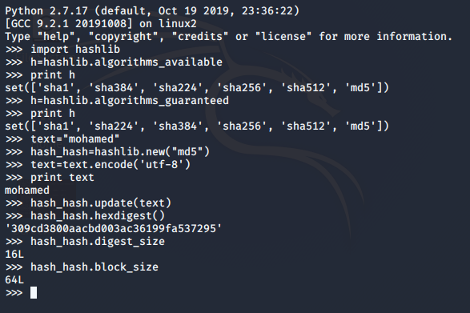

# Hashlib
Secure hashes and message digests 
This module implements a common interface to many different secure hash and message digest algorithms. Included are the FIPS secure hash algorithms ***SHA1, SHA224, SHA256, SHA384, and SHA512  as well as RSA’s MD5 algorithm .***
Hashlib provides the following constant attributes:
+ **hashlib.𝗮𝗹𝗴𝗼𝗿𝗶𝘁𝗵𝗺𝘀_𝗴𝘂𝗮𝗿𝗮𝗻𝘁𝗲𝗲𝗱** : a set containing the names of the hash algorithms guaranteed to be supported by this module
+ **hashlib.𝗮𝗹𝗴𝗼𝗿𝗶𝘁𝗵𝗺𝘀_𝗮𝘃𝗮𝗶𝗹𝗮𝗯𝗹𝗲** : a set containing the names of the hash algorithms
+ **hashlib.𝗱𝗶𝗴𝗲𝘀𝘁_𝘀𝗶𝘇𝗲** : the size of the resulting hash in bytes.
+ **hashlib.𝗯𝗹𝗼𝗰𝗸_𝘀𝗶𝘇𝗲 , hash.𝗱𝗶𝗴𝗲𝘀𝘁()**

